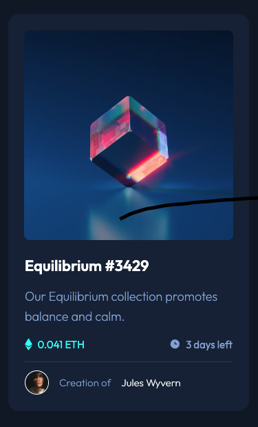

# Frontend Mentor - NFT preview card component solution

This is a solution to the [NFT preview card component challenge on Frontend Mentor](https://www.frontendmentor.io/challenges/nft-preview-card-component-SbdUL_w0U). Frontend Mentor challenges help you improve your coding skills by building realistic projects. 

## Table of contents

- [Overview](#overview)
  - [The challenge](#the-challenge)
  - [Screenshot](#screenshot)
  - [Links](#links)
- [My process](#my-process)
  - [Built with](#built-with)
  - [Useful resources](#useful-resources)
- [Author](#author)
## Overview

### The challenge

Users should be able to:

- View the optimal layout depending on their device's screen size
- See hover states for interactive elements

### Screenshot

### Links

- Solution URL: [Add solution URL here](https://your-solution-url.com)
- Live Site URL: [https://aeposten.github.io/nft-card/](https://aeposten.github.io/nft-card/)

## My process

### Built with

- Semantic HTML5 markup
- CSS custom properties
- Flexbox

### Useful resources

- [W3 Schools Image Hover Overlay Tutorial](https://www.w3schools.com/howto/howto_css_image_overlay.asp) - I used this guide to create the hover effect on the image

## Author

- Frontend Mentor - [@aeposten](https://www.frontendmentor.io/profile/aeposten)
- Linkedin - [Connect on Linkedin](https://www.linkedin.com/in/aeposten/)

